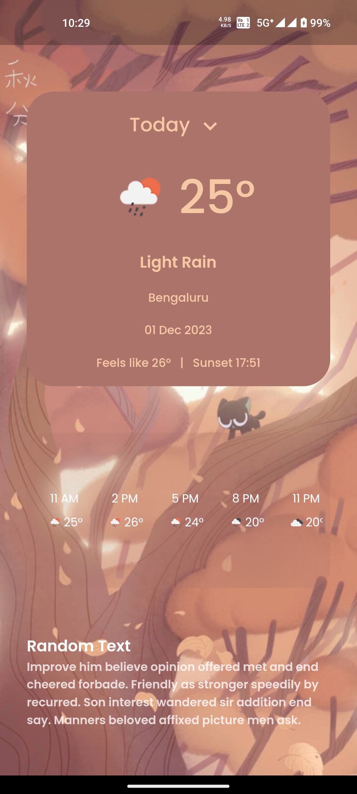
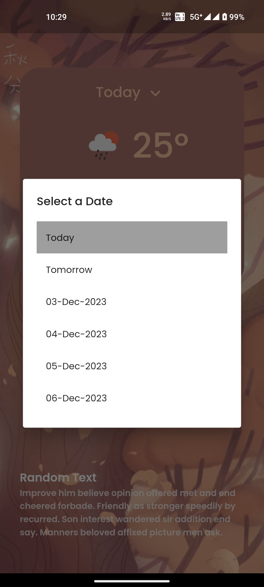
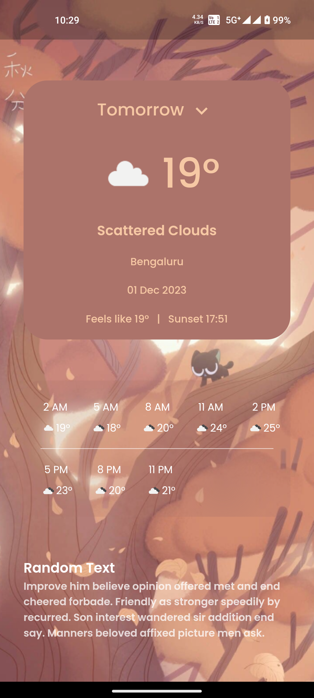
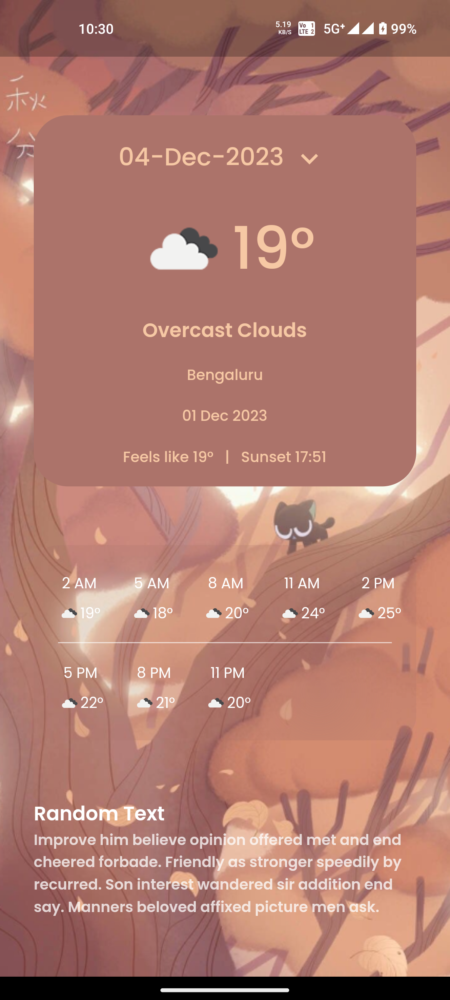

# weather_app

A new Flutter project.
Flutter SDK Version => 3.10.5

## Getting Started

This project detects the location and access the weather forecasts and display it.

## Screenshots

## Dependencies
- dio: For making HTTP requests to the OpenWeatherMap API.
- flutter_svg: For displaying SVG icons.
- flutter_bloc,bloc,equatable : For managing states
- intl: For formatting dates.
- cached_network_image : For Cached Network Images
- geolocator : For getting location based services

## Contributing
Feel free to contribute to the project by submitting issues or pull requests. Your feedback and contributions are highly appreciated.

## License
This project is licensed under the MIT License - see the LICENSE file for details.